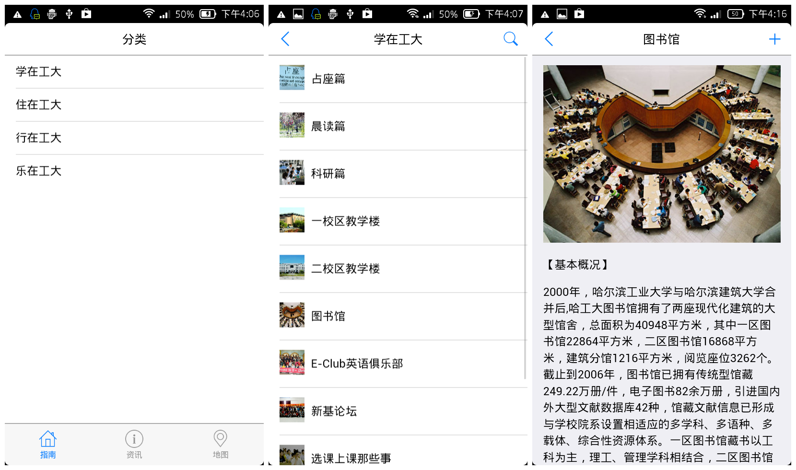
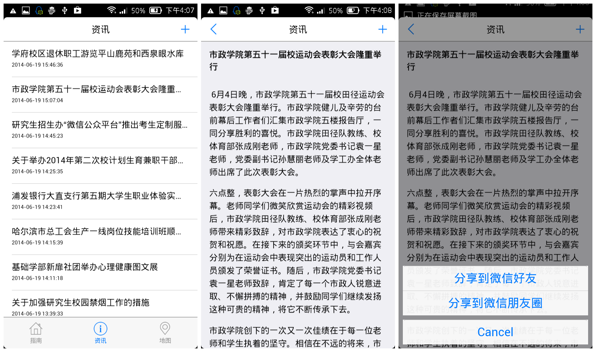
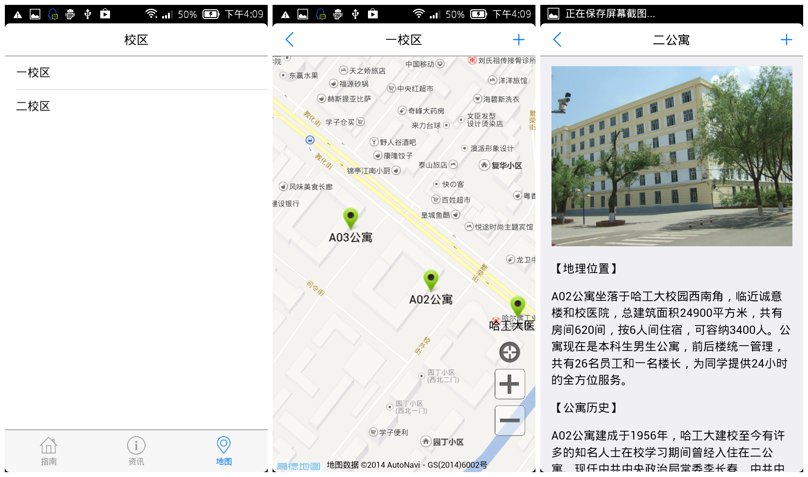

# Handy HIT

> Mobile guidance for Harbin Institute of Technology.

* It's now only availble for Android
* These instructions are for PhoneGap 3.4.0

## Index

1. [Screenshot](#1-screenshot)
2. [Requirement](#2-requirement)
3. [Installation](#3-installation)

## 1.Screenshots
Android







## 2.Requirement
* [PhoneGap CLI](https://github.com/phonegap/phonegap-cli)
* [Android SDK](http://docs.phonegap.com/en/3.4.0/guide_platforms_android_index.md.html#Android%20Platform%20Guide)

## 3.Installation
create project
```
$ phonegap create handy-hit
```
add android platform
```
$ cd handy-hit
$ phonegap platform add android
```
add plugins
```
$ phonegap plugin add https://github.com/scorpio147wbh/phonegap-share-plugin.git
$ phonegap plugin add org.apache.cordova.network-information
$ phonegap plugin add org.apache.cordova.geolocation
```
remove www dir that comes with the project
```
$ rm -rvf www
```
clone this repo into www dir
```
$ git clone https://github.com/scorpio147wbh/handy-hit.git www
```
copy www/res/screen/android/* into platforms/android/res
```
$ cd www
$ cp -rf res/screen/android/* ../platforms/android/res/
```
copy www/res/icon/android/icon-96-xhdpi.png into platforms/android/res/drawable/icon.png
```
$ cp -f res/icon/android/icon-96-xhdpi.png ../platforms/android/res/drawable/icon.png
```
build project, on root of project
```
$ cd ..
$ phonegap local build android
```
the HandyHIT-debug.apk is generated on platforms/android/ant-build
